<!--
 * @Author: 杨光辉(GerhardYang)
 * @Date: 2021-04-23 18:55:22
 * @LastEditors: 杨光辉(GerhardYang)
 * @LastEditTime: 2021-04-24 22:54:56
 * @Description: file content
 * @Copyright: 超图软件华中平台客户中心 (SuperMap Software Co., Ltd. -Central China Platform)
-->

# 1 、准备工作

## 1.1 、3ds Max 软件准备

3ds Max 模型由超图软件提供的插件从 3ds Max 软件中转出为超图 udb/udd 数据源。提供的插件适配 Autodesk 3ds Max x64 版本（可选 2014、2016、2018、2020），请您准备对应版本的 3ds Max 软件。

## 1.2 、超图系列软件准备

请您访问超图软件官方网站下载对应软件，下载地址：[http://support.supermap.com.cn/DownloadCenter/ProductPlatform.aspx](http://support.supermap.com.cn/DownloadCenter/ProductPlatform.aspx)

请您尽可能安装当前官网能获得的最新版本，并在需要技术支持时，向超图软件技术工程师提供您的软件版本信息。

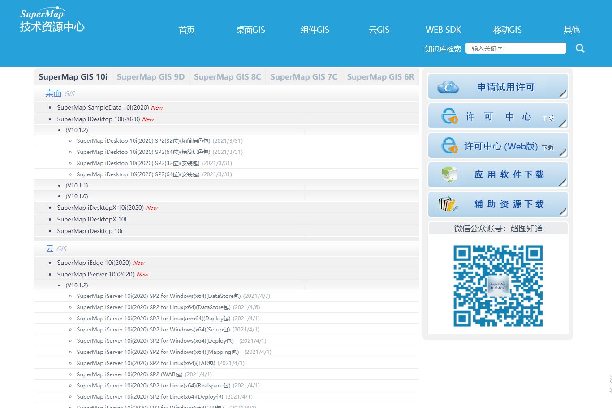

如需处理、加载、分析 3ds Max 数据，请您下载超图二三维一体化桌面 GIS 软件 SuperMap iDesktop。

1. 在桌面端展示以及使用仅需要iDesktop。
2. 如需在web展示以及使用，则还需要下载超图云 GIS 应用服务器软件 SuperMap iServer，服务器如果是 Windows 环境推荐下载 ZIP 包，如果是 Linux 环境推荐下载 TAR 包。

3. 软件安装成功即可开始使用，自带 3 个月试用期，如需要继续试用或遇到许可问题，请与超图软件技术工程师联系。

## 1.3 、硬件准备

请准备一台性能较好的计算机用于安装软件并处理 3ds Max 数据，至少需具备独立显卡，推荐采用 GTX1060 以上显卡。

设备的性能直接影响数据处理的速度，预备好的数据处理设备，将大幅提升处理效率与显示性能。

## 1.4 、数据协调

准备需要进行数据呈现的 3ds Max 数据，并从数据生产者处获取模型的坐标系和参考点坐标（3ds Max 数据原点对应的真实世界坐标）。

# 2 、3ds Max 插件安装

## 2.1插件安装包获取

请您下载对应插件，下载地址：<https://eyun.baidu.com/s/3dzbgVO>，百度云盘密码：**`8SsM`**，下载“`Max 插件`文件夹下所有内容。

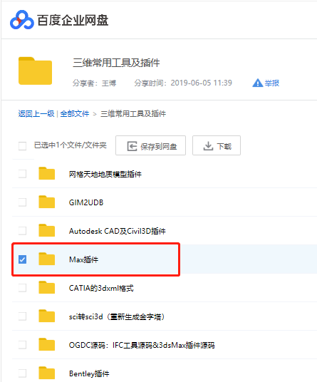
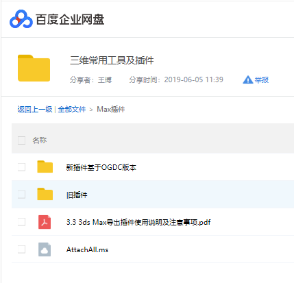

## 2.2插件安装

不同版本插件的安装使用方式是相同的，这里以 2014 版为例进行说明。在下载的插件包内`新插件基于 OGDC 版本`中：

- 1.将 `SuMax2014Plugin.gup` 文件复制到 Autodesk 3ds Max2014 安装目录下的 `stdplugin` 文件夹中；
- 2.解压 Bin_Unicode_x64.rar，并将其设置为环境变量 `Path` 路径的最前端；
- 3.插件安装成功后，重启 Autodesk 3ds Max 2014 软件，菜单栏中新增`SuperMap 3DMax`插件选项。

::: warning
插件的运行依赖超图软件许可
:::

插件安装到这一步即可正常使用，如果无法顺利运行插件，请您用以下方式检查及处理：

- 1.检查环境变量 Path 路径；
- 2.检查超图软件许可配置；
- 3.尝试以管理员身份重新启动 3ds Max；
- 4.尝试重启计算机；

如果仍然无法正常运行，请与超图软件技术工程师联系。

# 3、3ds Max 模型导出

在模型导出之前，您需要准备一个 udb 数据源，如果您还没有 udb 数据源，请先用超图 iDesktop 新建一个数据源，在工作空间管理器中【数据源（右键）-新建文件型数据源】，选择保存类型为\*.udb/\*.udbx。开始导出前，请确保在 iDesktop 中关闭目标数据源，以免独占导致导出失败。

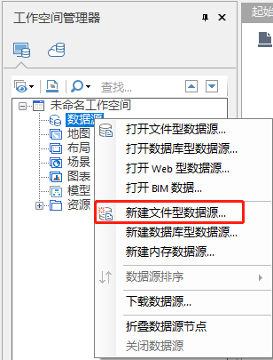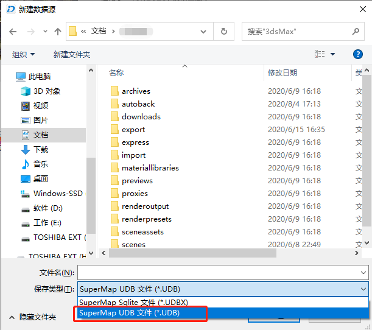

如果模型带有影像数据，请将影像和模型分开导入，影像的导入过程参考《SuperMapGIS 影像数据处理流程》。

如果需要导入的模型比较多，面数比较大，可以用过滤的形式先导入一部分，再导入另一部分，可以节省大量的时间。

模型导出在 3dsMax 软件中进行，点击【超图 Max 插件-生成模型数据集】，进入生成模型数据集功能页面，配置导出参数。

- 1.场景投影信息：根据模型的参考点坐标（3ds Max 数据原点对应的真实世界坐标）填写场景投影信息，如果参考点为经纬度表示，请选择【球面坐标】填写，如果参考点为 xyz 表示，请选择【平面坐标】填写。插件对坐标没有精度限制，数据生产者提供的参考点精度决定定位的精度。

- 2.Max 纹理信息：填写模型纹理所在的文件夹（建议您将模型纹理存放在一个单独文件夹）。

- 3.导出选项：根据需要选择【只导出可见模型】或【导出所有模型】。

- 4.文件生成信息：推荐**不要勾选**【去除材质颜色】、【去除重复点】、【不带法线】。

- 5.数据源文件路径：选择目标数据源文件\*.udb 的路径，如果其中已经有可选数据集，可以直接选择该数据集，如果没有数据集，可以点击【新建数据集】创建，模型将被导入选择的数据集中。

  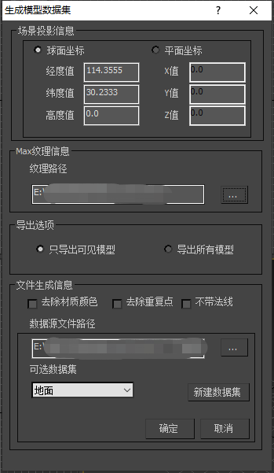

如果您需要导出的模型较多，可以采用【超图 Max 插件-批量导入模型】来实现，如图 7。与上文生成模型数据集方式相比，批量导出需要设置 Max 文件的目录，在导出时会将该目录下所有的 3ds Max 模型全部导出，其他的参数配置与上文生成模型数据集方式一致。

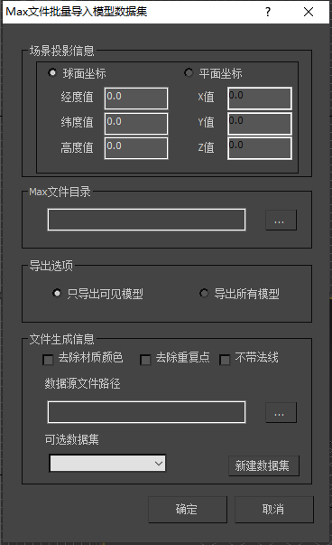

::: tip
 Max 文件批量导入模型数据集配置界面
:::

模型导出需要一定的时间，耗时与您的模型体量与复杂程度以及机器性能有关，请耐心等待。如果显示“未响应”，请不要急于关闭，可以查看任务管理器，如果磁盘读写仍在进行表示插件仍在正常运行。导出成功后，将弹窗提醒，您将获得存储有模型数据的\*.udb/\*.udd 数据源文件，可以在超图系列软件中直接使用。

## 3.1、设置坐标系

在 iDesktop 工作空间管理器中，【数据源（右键）-打开文件型数据源】，打开导出生成的\*.udb/\*.udd 数据源。

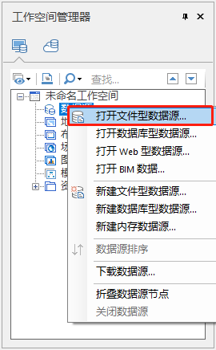

在工作空间管理器中，【对应数据集（右键）-属性】，在右侧出现的属性栏中选择【坐标系】，即可查看该数据当前的坐标系。

可以直接为模型数据指定正确的坐标系，点击【重新定义坐标系-更多】按钮。

图 10 重新定义坐标系

进入坐标系设置界面后，请按照目标坐标系的名称或 EPSG
Code 搜索，并选中目标坐标系，点击【应用】即可将当前数据的坐标系设置成目标坐标系。如果您的目标坐标系不是常规坐标系，请点击【新建坐标系】，根据提示输入坐标系信息，创建出该坐标系并应用。

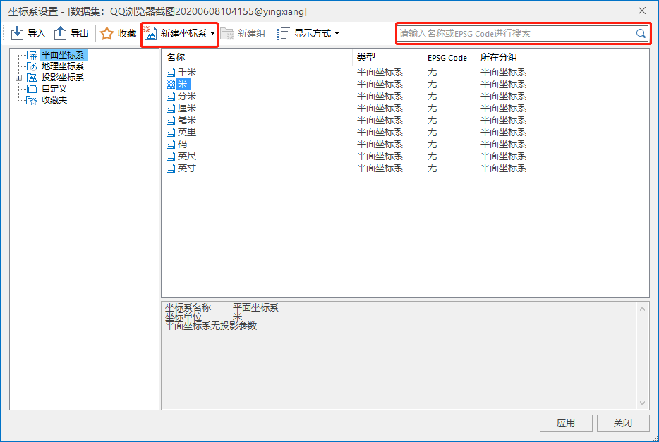

## 3.2 、场景加载

【目标数据集（右键）-添加到新球面/平面场景】，球面场景支持加载地理坐标系和投影坐标系的数据，平面场景支持加载平面坐标系和投影坐标系的数据，二者都是三维视图，请根据需求选择。

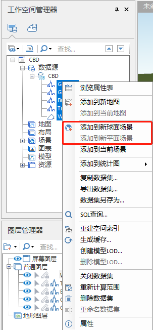

在图层管理器中双击对应的模型图层，或对该模型图层右键选择【缩放到本图层】或【快速定位到本图层】，即可浏览三维模型。

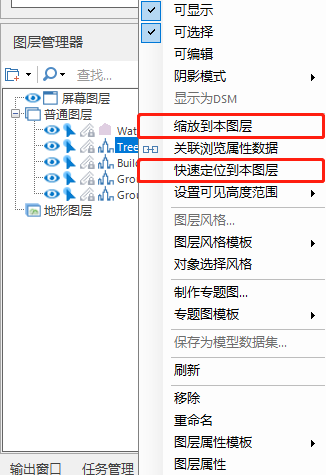

## 3.3 、检查数据位置

需要核对该模型的位置是否正确，可以在 iDesktop 中叠加其他数据进行检查。

如果您的测试机器可以连接互联网，可将超图软件在线示范数据与模型数据叠合，以判断数据位置是否正确。超图软件三维在线示范数据通过【场景-在线地图】打开（注意：需要有已打开的三维场景，才能看到场景选项卡，因在线示范数据通过互联网传输，且为全球数据，将影响场景显示流畅度，数据位置核对后，请在图层管理器中移除在线数据图层）。

如果您的测试机器不能连接互联网，可以将您的其他数据加入场景中与模型进行位置核对，或者根据地图框下方的坐标信息判定。

# 4、数据优化（选做）

本章节针对浏览效果和效率存在问题的数据提出解决办法，如果您对模型数据在三维场景的浏览效果和效率比较满意，或您只需要测试技术路线是否能达成目标，不需要进行本章节操作。

## 4.1 、显示优化

如果您的模型导出后出现了纹理、色彩、明暗、坐标位置、尺寸等方面的问题，可以参考本节内容尝试解决。

### **（1）缺少部分面**

观察到部分面缺失的，可以在 iDesktop 中，【场景-属性-图层属性】设置渲染模式为双面。可以在 3ds
Max 中将对应面的法线翻转。可以检查导出时纹理是否都存放在指定的文件夹中。

### **（2）部分面显示异常**

观察到部分面虽然存在，但显示异常，呈现有一定透明度、虚影的，可以找到该面的纹理图片，查看图片属性，如果其位深度为 48，需要通过图片编辑软件将位深度改为 24 或 32。

### **（3）模型色彩整体很亮或很暗**

- 1.观察到模型色彩很暗，可以在 3ds Max 中取消角点颜色，可以启用 Gamma校正，改变场景中看到的效果。在 3ds Max 中，通过单栏下的“自定义-首选项-Gamma和 LUT-Gamma”功能查看 Gamma 值。
- 2.在 SuperMap iDesktop 中，通过“图层属性-模型-颜色-伽马”调节；在 SuperMapiClient3D for WebGL 中通过 S3MTilesLayer 上的 gamma 参数进行调节。

### **（4）模型没有颜色**

当所有的模型都没有色彩时，检查导出时是否勾选了去除材质颜色。

### **（5）模型没有纹理**

导出后的模型只有材质颜色，没有对应的纹理图片的，检查导出时纹理路径填写是否正确，所有纹理是否都在该路径，纹理路径不能太深。

### **（6）壳材质烘焙纹理未导出**

有的用户会将阴影效果添加到壳材质上的烘培材质中，插件默认导出壳材质中的原始材质，没有导出壳材质中的烘培材质。

-  1.新版本的插件支持导出两个纹理。通过在插件面板勾选“导出第二重纹理”选项，即可将烘培材质中的纹理贴图一起导出。

- 2.在制作壳材质的过程中，将烘培结果去壳。在“渲染到纹理”选项框中找到“清除外壳材质”命令，点击“保留烘焙材质”选项，渲染后得出来的模型就是一份烘焙在源上的文件，另存该文件并进行导出。具体操作步骤可参考文章
[SuperMap 平台中三维模型烘焙的处理步骤及应用](https://blog.csdn.net/supermapsupport/article/details/68928384)

### **（7）自发光贴图未导出**

有的用户数据会将阴影效果烘培到自发光纹理贴图上，插件默认只导出漫反射贴图，使得导出的模型失去了明暗效果。同样可以通过勾选“导出第二重纹理”选项，同时将自发光纹理贴图导出。

需要注意的是，目前最多支持导出漫反射与自发光两个纹理贴图。高光贴图，凹凸贴图等是不支持导出的。

目前 UDB 格式的数据并不支持自发光的效果，想要导出自发光的效果，需要将模型导出为 FBX 数据，然后加载到 Unity 中，通过 Unity 导出为 Gltf 文件。

### **（8）模型浏览出现摩尔纹**

早期部分插件版本的导出模型，在纹理有大量重复排列的地方常出现摩尔纹。具体表现为纹理断断续续，且在移动视角观察时，虚线闪烁明显，且纹理呈水波状变化。可以更新新插件版本重新导出解决。

### **（9）模型坐标不正确**

确保输入了正确的参考点，并设置了正确的坐标系后，模型位置仍然不正确的，可以在 3ds Max 确定中心轴使中心轴的位置位居于模型中央，删除多余的空值物体。

### **（10）模型尺寸异常**

模型尺寸出现极大异常的，可以在 3ds Max 中将单位设置改为米。

## 4.2、性能优化

如果您的模型导出后出现了浏览卡顿的问题，可以参考本节内容尝试解决。

### **（1）查看场景帧率**

将 3ds Max 模型数据添加到 SuperMap iDesktop 三维场景中，在场景属性中，勾选帧率，查看三维模型浏览时的帧率，平均帧率需要在 25 帧以上，理想帧率至少是 35 帧以上。

如果帧率比较慢，逐个图层检查，控制其显示或隐藏，定位影响显示帧率的图层，然后对其做优化处理。

### **（2）数据分类**

在 SuperMap iDesktop 三维场景中加载 3ds Max 模型数据，将数据按照地物类型进行拆分，例如拆分为：建筑物、地面、水面、道路、小品、绿植、地标等。在拆分时，可以根据数据属性字段中标识的类型，选中对应的行，然后将选中行另存为模型数据集，从而实现将数据拆分为不同类型的模型数据集。

SuperMap iDesktop 里面已经内置了很多符号模型，同时支持导入三维符号模型，可以将水面、绿植等采用符号模型替代。例如水面模型数据集，使用提取边界功能生成三维面数据集，将其添加到三维场景中，设置其填充风格样式。

如果模型中缺少必要的字段，无法区分对应的地物类型，可以在图层管理器中选择对应的图层，通过关联其属性信息，确定对应的地物类型，然后对其进行分类。

### **（3）检查三角面片数和顶点数**

在 SuperMap iDesktop 中可以看到场景中所有的三角面片数和顶点数，并且可以查看单个模型的三角面片数和顶点数。

单个对象的三角面片数和顶点数的查看只需要双击对象在弹出的对象属性框中选择模型。

还可以使用属性提取功能，提取模型的顶点数，结果保存到模型属性字段中。

### **（4）检查模型纹理贴图大小**

在 SuperMap iDesktop 三维场景中，选择要查看的模型，在模型属性信息中找到材质信息，可以看到模型纹理贴图使用的文件格式、纹理文件大小，纹理文件像素大小最好在 1024\*1024 以下。

### **（5）三角网简化**

如果模型的三角面过多影响模型加载效率，在 SuperMap iDesktop 里面，使用三角网简化来减少模型的三角网数量。根据模型的复杂、重要程度，确定简化的百分比，结果可以保存为新的数据集。

在该功能中，勾选“简化时约束边界”，可以保证模型在三角网简化过程中，保证模型不发生变形。

点击统计三角面数，在简化过滤三角面数过滤出要简化的对象。

简化信息中，选择要简化的程度。在简化信息里面滑动，然后在场景右侧会显示出优化的结果，保证模型不变形的情况下尽量简化。

### **（6）检查单个对象大小**

单个对象的面积不能太大，比如有的对象是一个片区的草地或者树，也会导致生成的缓存文件过大，影响数据网络传输和加载。此时，可以使用模型拆分功能，把该对象按照一个合理的大小去拆分即可，也可以使用模型打散功能，将单个模型对象拆分为多个对象。

如果对象属于建筑物，而且已经是单栋建筑物的话，考虑后期选择查询的需求，不建议使用模型拆分或模型打散功能。

### **（7）检查重复点**

在 SuperMap iDesktop 三维场景中，选择需要检查的图层，使用检查重复点功能，剔除模型当中重复点，可以将检查结果覆盖原来的数据集，或者另存为新的数据集。

### **（8）检查重复面**

在 SuperMap iDesktop 三维场景中，选择需要检查的图层，使用检查重复面功能，剔除模型当中重复面，检查结果可以覆盖原来的数据集，或者另存为新的数据集。

# 5、缓存制作服务发布

## 5.1 、生成三维缓存

制作缓存有利于各端更流畅浏览精模数据，过程通过工作空间管理器【目标精模数据集（右键）-生成缓存】或者将精模数据添加到三维场景中并保存场景后【目标场景（右键）-生成场景缓存】完成。

对数据集生成缓存相比较对场景生成缓存，允许配置更多个性化参数，更复杂但自由度更高。对于复杂的模型，建议对模型数据集生成缓存。

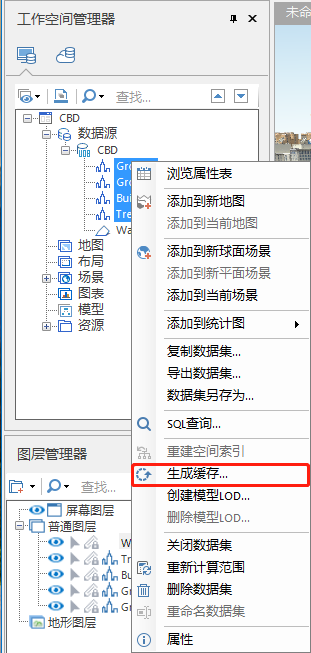

在生成缓存功能界面，可以对缓存生成的模式进行配置，如上图所示，参数设置请参阅 iDesktop 帮助文档《生成三维切片缓存》专题，您可以根据需要精准选择，如果您无法决定某些参数的设置，可以参考以下建议：

- 1.缓存用途：根据缓存用于 PC 端或移动端选择。

- 2.存储类型：建议选择原始。

- 3.文件类型：建议选择 S3MB。

- 4.LOD 层级：LOD 层级数对模型显示时的切换平滑效果有影响：LOD 层级数越大，模型显示时切换的效果越平滑；另一方面，LOD 层级数设置过大，将导致生成冗余层级的模型，生成缓存耗费时间较长。不采用建议 100%，可以从 50%开始，采用 50%、60%、60%、70%、80%，可以根据数据集类型，采用合适的 LOD 层级，例如建筑物采用 5 级、地板生成 3 级、树木和小品模型生成 3 级。

- 5.重新计算法线与实例化：建议不勾选。

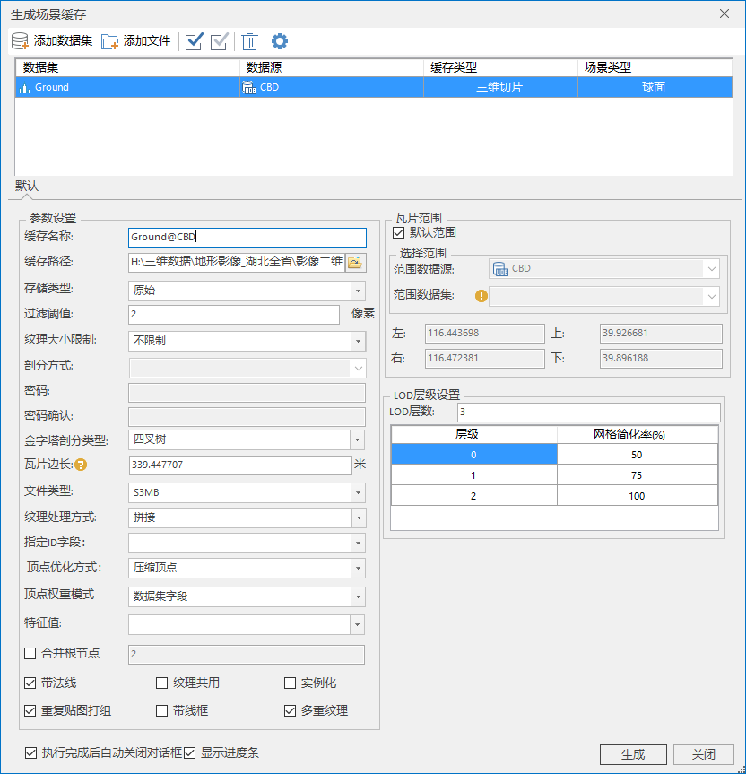

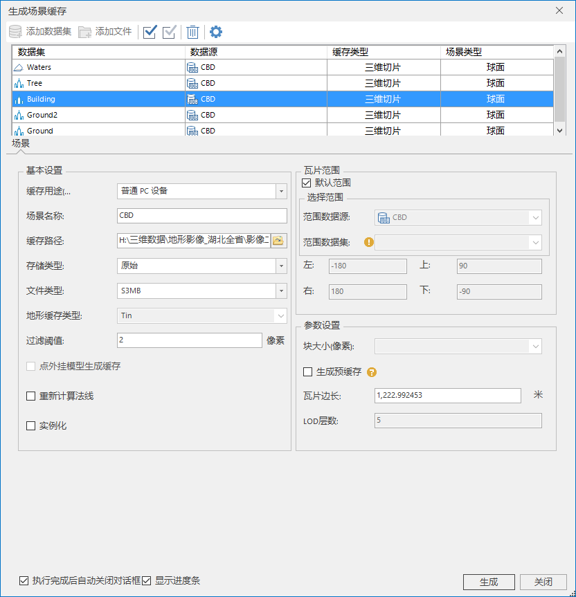

缓存生成结束后，将生成存放三维切片的文件夹和加载有三维切片的\*.sxwu 工作空间，直接打开该工作空间即可预览生成的缓存。

## 5.2 、缓存检查

模型数据生成缓存后，查看单个 S3M 文件的大小，理想值是单个文件小于 1MB，最好不要超过 3MB。

如果单个 S3MB 文件过大，可能是单个模型对象过大造成的。首先确定 S3MB 文件所在模型数据集和对应对象，然后使用模型拆分或模型打散功能将对象进行拆分。还可以将拆分后的模型，根据对象类型合并到其他图层中。或者采用降低瓦片边长的方式，降低单个 S3MB 文件大小。

瓦片边长决定了缓存根节点数量：边长越大，根节点越少；相反，边长越小，根节点越多，生成缓存时间更长。根节点数量过多时，加载模型将在一定程度上变慢。

修改完成后，需要再重新生成 S3MB 缓存。

## 5.3、缓存设置

打开生成的\*.smwu 工作空间，对于重要性程度相对较低的图层，限制其可见距离和可见高度。【场景-属性-图层属性】（需要有打开的场景，否则您将无法看到场景选项卡），设置图层的【最大/最小可见高度】和【最大/最小可见距离】，浏览场景直至满意。

该步骤在生成缓存后操作，如果在最初数据优化阶段就已设置，在生成缓存后需要重新设置。

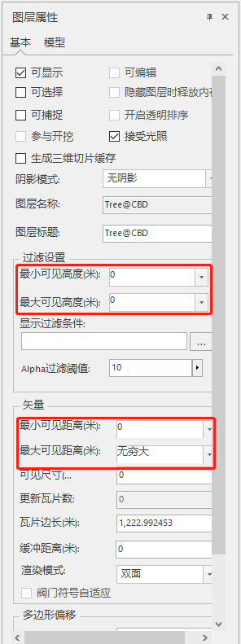

将场景调整到合适的视角，【Ctrl+S】保存场景与工作空间，准备服务发布。

## 5.4、缓存建库

本文档只作为数据处理并浏览的步骤说明，适用于快速测试阶段。如您仅做快速测试，无需进行缓存入库，可以跳过这一步骤。

如需进行正式项目建设，建议对二三维缓存数据入 MongoDB 库，有利于正式项目对数据的更新和维护。MongoDB 入库与MongoDB 缓存服务发布具体过程请参考《SuperMap GIS 缓存 MongoDB 入库》文档相关步骤。

## 5.5 、服务发布

如您需要测试精模数据在 web 端、移动端浏览，并开发一些功能，需要进行服务发布。

启动 SuperMap iServer，【iServer 安装目录-bin-startup.bat 保持运行】，后在首页[http://localhost:8090/iserver/](http://localhost:8090/iserver/)选择【服务管理-快速发布服务】。

数据来源选择【工作空间】，点击【下一步】，注意：iServer 发布服务时，请在 iDesktop 中关闭要发布的工作空间，以免工作空间被占用导致发布不成功。

工作空间类型选择【文件型】，工作空间路径点击【远程浏览】并指定本文 4.1 章节中生成的\*.smwu 工作空间路径，如果该工作空间设置有密码，请填写密码，否则空置即可，点击【下一步】。

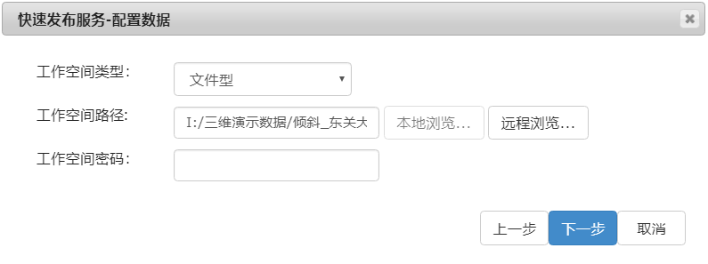

选择发布的服务类型为【REST-三维服务】，如果精模属性表中有属性数据，且需要通过开发实现属性查询和显示，请一并勾选发布【REST-数据服务】，点击【下一步】，弹出配置完成窗口即发布完成。

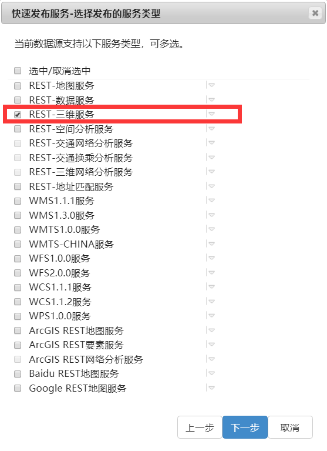

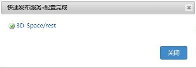

::: warning
超图软件 web 端三维大部分采用免插件的 webgl 技术路线，请您使用 chrome 内核浏览器浏览三维场景。如果您有特殊需要，必须使用 IE 内核浏览器浏览，请咨询超图软件技术工程师安装插件。
:::

点击该服务，依次点击选择【realspace --> scenes -->  WebGL3D (支持浏览 s3m缓存)】即可实现服务预览。

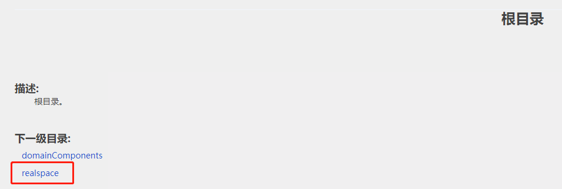

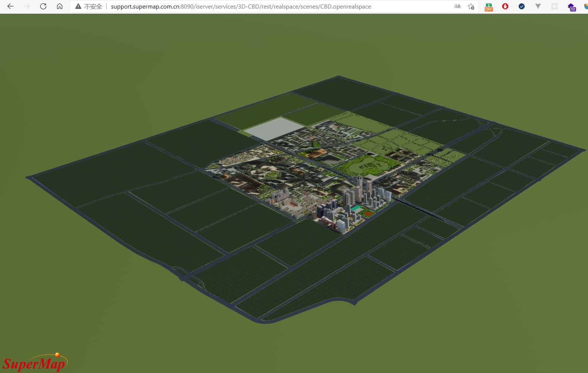

或者，在 iServer 首页http://localhost:8090/iserver/，点击【服务管理-服务管理-三维服务】之后，再选择【服务地址 --> realspace --> scenes -->  WebGL3D(支持浏览 s3m缓存)】即可实现服务预览。

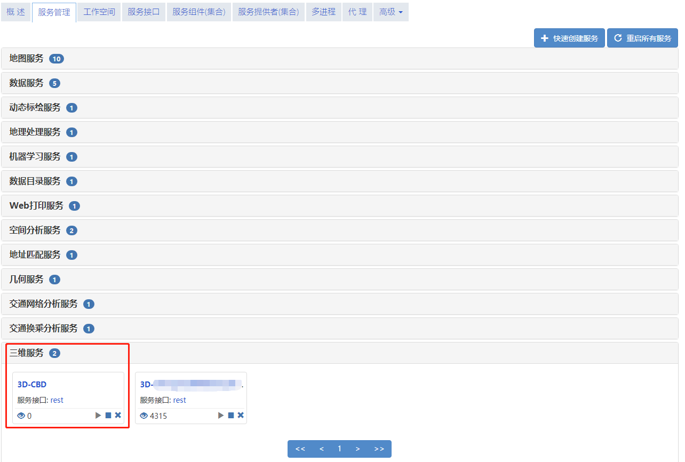
