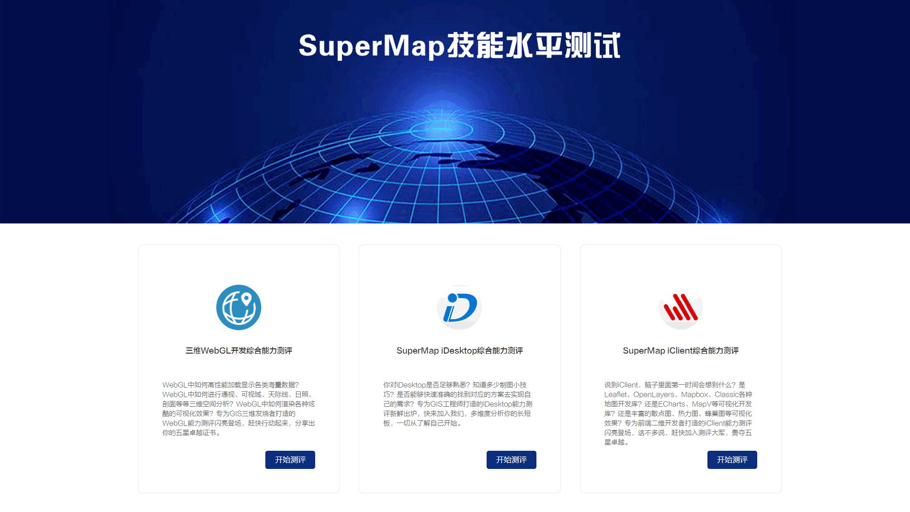

<!--
 * @Author: 杨光辉(GerhardYang)
 * @Date: 2021-04-23 18:29:47
 * @LastEditors: 杨光辉(GerhardYang)
 * @LastEditTime: 2021-04-24 21:59:31
 * @Description: file content
 * @Copyright: 超图软件华中平台客户中心 (SuperMap Software Co., Ltd. -Central China Platform)
-->

## 学院简介

&emsp;&emsp;917大学GIS学院（下文简称“GIS学院”）是一个致力于GIS人才技能培养的部门，以“为企业输送高品质GIS人才，为学员培养持续就业的竞争能力”为目的，以突出GIS行业培训特色、突出社会市场需求、突出实际应用为原则，为超图客户、合作伙伴、地理信息从业者、在校大学生、高校GIS教育工作者以及广大地理信息技术爱好者提供专业的GIS技术培训和咨询服务。

&emsp;&emsp;GIS学院专注于地理信息产业中各种类型GIS人才的培养，提供多种形式的培训服务，包括网络录播课程、直播课程、线下面授课程服务，学员可以根据自身情况进行选择。

&emsp;&emsp;GIS学院拥有专业的教研队伍，培训讲师均具有GIS或者计算机专业硕士以上学历，同时还具有丰富的教学经验和多年的GIS项目从业经历，保障教学目标高效高质量的达成。GIS学院还专门设立了讲师认证机制，邀请社会各界专业人士加入讲师团队，共创事业。

&emsp;&emsp;GIS学院还与多家国内外大学、企事业单位，达成深度战略合作，共同推出面向地理信息从业者、在校大学生的各类GIS优质课程，旨在培养出一批高素质、综合型的标杆人才。GIS学院也将遵循增值、协作、共赢的原则，诚邀地理信息产业及培训产业各类伙伴，共同合作建立优质的培训服务联盟，为广大企业及行业用户提供全面化的专业GIS培训与咨询服务。

## [网络课程](http://edu.supermap.com/#/lessonlist)   

## [技能测试](http://edu.supermap.com/#/jnspcs) 
 
## [直播回顾](http://edu.supermap.com/#/zbkclist)
