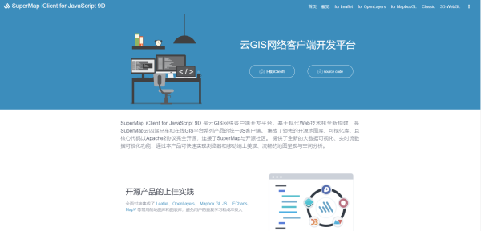
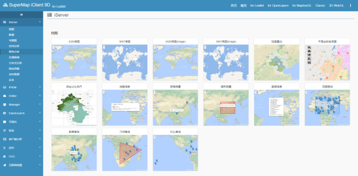
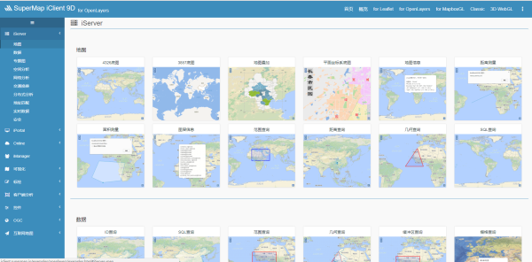
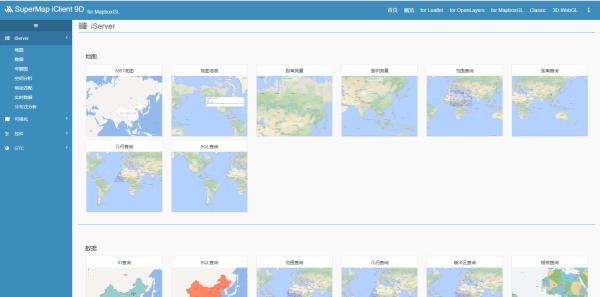
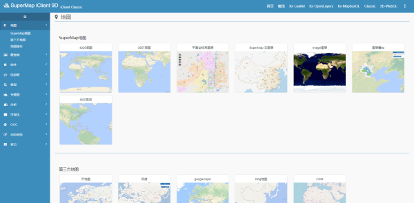
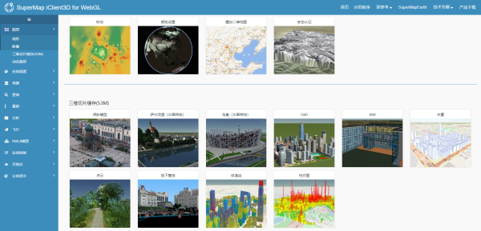
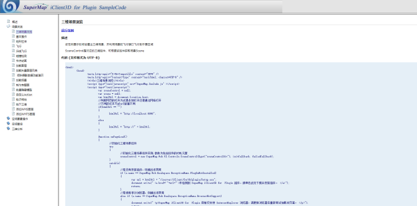
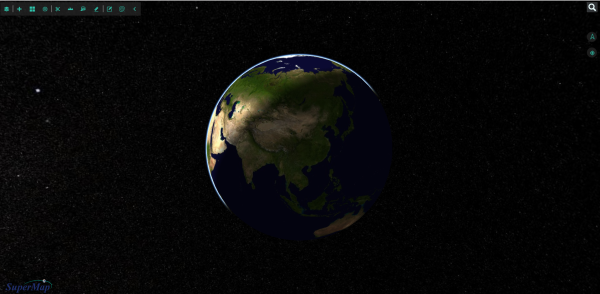

# iClient

## [SuperMap iClient9D 官网](http://iclient.supermap.io/)

## [for Leafle](http://iclient.supermap.io/examples/leaflet/examples.html)

## [for OpenLayers](http://iclient.supermap.io/examples/openlayers/examples.html)

## [for MapboxGL](http://iclient.supermap.io/examples/mapboxgl/examples.html)

## [Classic (8C)](http://iclient.supermap.io/examples/classic/examples.html)

## [3D for WebGL](http://support.supermap.com.cn:8090/webgl/examples/examples.html)

## [3D for Plugin](http://support.supermap.com.cn:8090/plugin/online/SuperMap/samplecode/default.html)

## [SuperMap iEarth](http://www.supermapol.com/earth/)

  

**Copyright © Gerhard**
