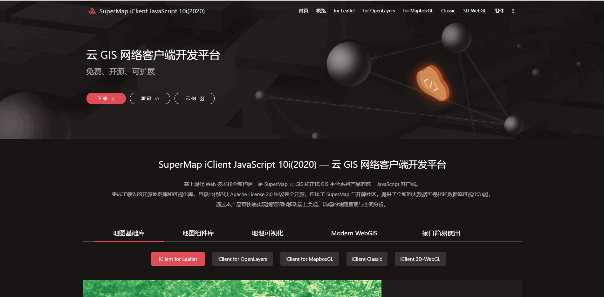
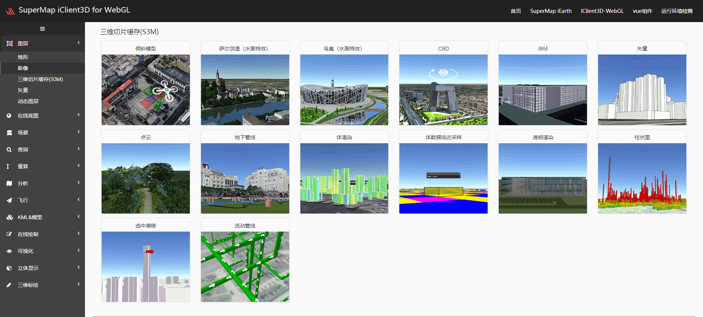
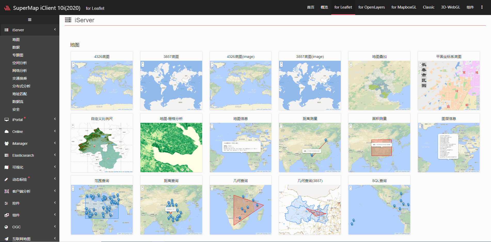
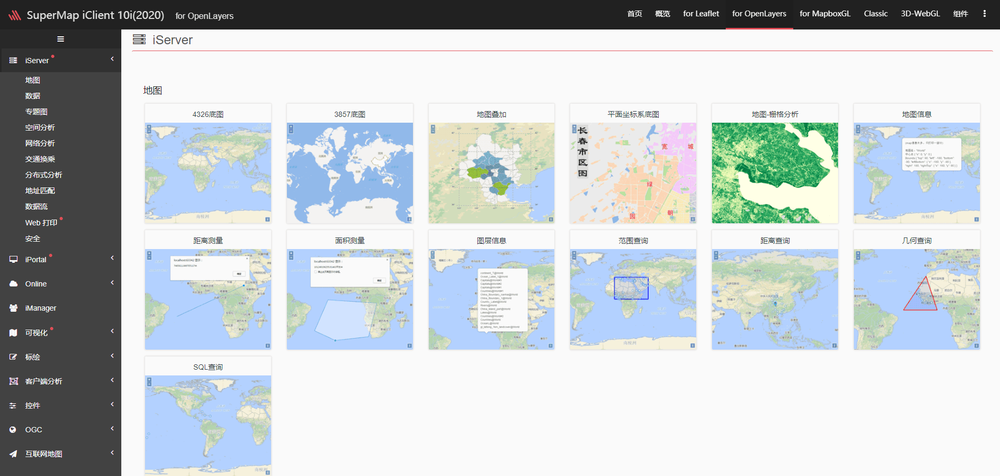
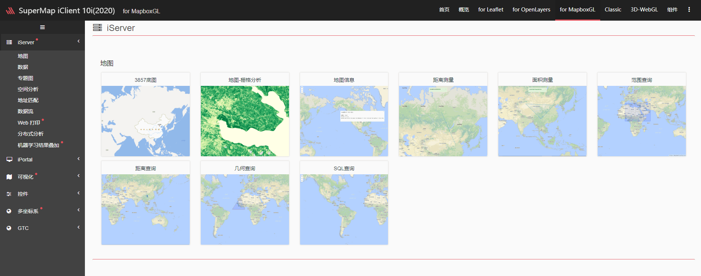
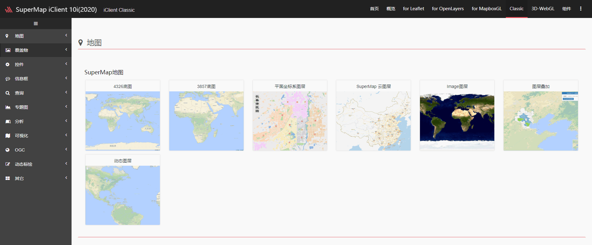
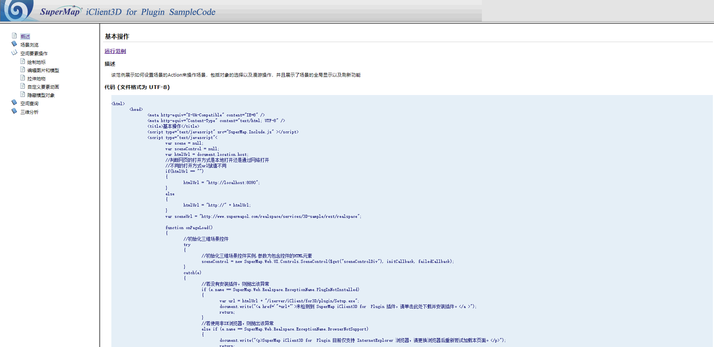
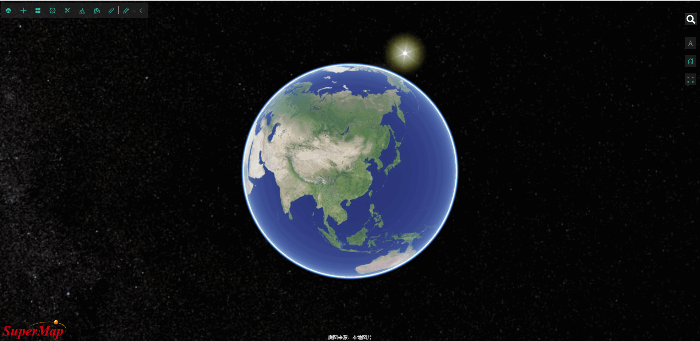

<!--
 * @Author: 杨光辉(GerhardYang)
 * @Date: 2021-04-23 18:29:47
 * @LastEditors: 杨光辉(GerhardYang)
 * @LastEditTime: 2021-04-24 21:59:17
 * @Description: file content
 * @Copyright: 超图软件华中平台客户中心 (SuperMap Software Co., Ltd. -Central China Platform)
-->

## [SuperMap iClient 官网](http://iclient.supermap.io/)

## [SuperMap iClient3D for WebGL](http://support.supermap.com.cn:8090/webgl/examples/webgl/examples.html)

## [SuperMap iClient for Leafle](http://iclient.supermap.io/examples/leaflet/examples.html)

## [SuperMap iClient for OpenLayers](http://iclient.supermap.io/examples/openlayers/examples.html)

## [SuperMap iClient for MapboxGL](http://iclient.supermap.io/examples/mapboxgl/examples.html)

## [SuperMap iClient Classic (8C)](http://iclient.supermap.io/examples/classic/examples.html)

## [SuperMap iClient3D for Plugin](http://support.supermap.com.cn:8090/plugin/online/SuperMap/samplecode/default.html)

## [SuperMap iEarth](http://www.supermapol.com/earth/)

<supermap-statistics/>
